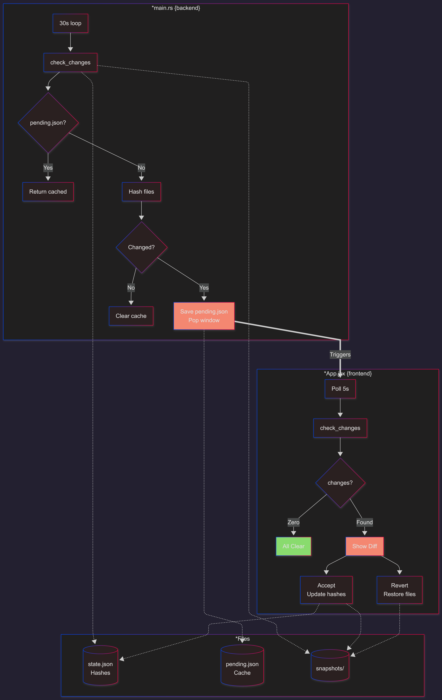
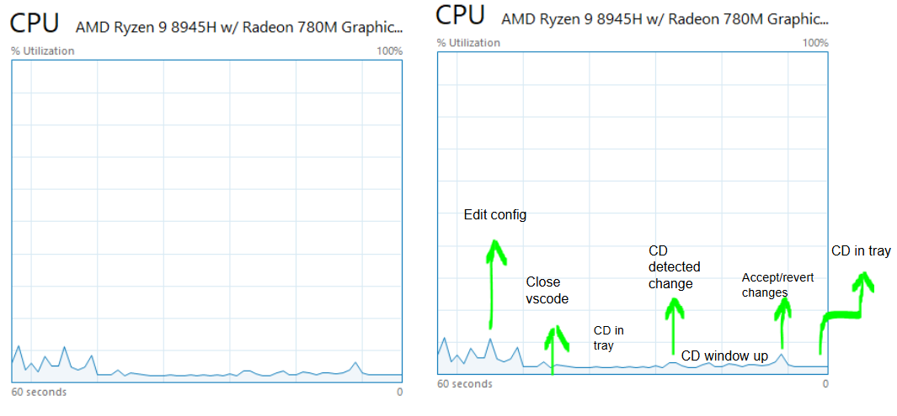
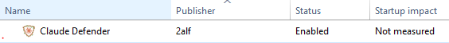

# Claude Defender
<image src="./repo-img/logo.png" width=300px>
<br>

```
MCP Config Monitor for Claude Desktop
```
Detects changes to Claude Desktop MCP config and server code. Shows overlay on startup.

---
## Content
- [Questions](#Qs)
- [Setup Tauri](#setup-tauri)
- [Setup Python](#setup-python)
- [Usage](#usage)
- [License](#license)
- [Hall Of Fame](#hall-of-fame)

---
## Qs

### Why?
Protect your Claude Desktop against becoming a trojanised entry point to attackers via toolpoisoning or similar techniques. 

*(Research paper about MCP as a LOTL soon..)*

### How?
Stores MD5 hashes of your config file and all server source files. On each Claude launch, compares current hashes against stored ones. If anything changed, shows an overlay notifying you of what changed and what should be audited.

The state storage is inside a tmp MCPMonitor directory. <br>
In each OS its stored in one of these:

- **Windows**: `%LOCALAPPDATA%\MCPMonitor\`
- **macOS**: `~/Library/Application Support/MCPMonitor/`
- **Linux**: `~/.local/share/MCPMonitor/`


This monitor file contains:
- `state.json` - file hashes
- `snapshots/` - previous versions
- `backups/` - pre-revert backups




### Python V Tauri
#### Python: 
- You need python to run it and you need to manually configure the startup checker. 
- Easier to modify on your own.

#### Tauri: 
- We setup everything for you via installation. 
- Slightly faster. 
- Need rust and tauri to modify on your own.

### Bloat?
Watch mode:
- `~0.1% CPU, ~20MB RAM.`
- Just sleeps and polls tasklist every second.

On check: 
- Brief spike reading files and computing hashes, then back to idle.



It's lighter than most system tray apps. <br> 
You won't notice it.

### Future?
- ~~Add proper code audit with user accepting or reverting the changes.~~
- Improve code AND config audit.
- Same as above, but also being able to quarantine servers.
- Follow the `.log` installation trace that Claude Desktop provides for further Intrusion analasys
- ~~Rewrite in rust?~~

### Can i help?
Yes. 
We want Claude Defender to be an opensource project so all PR requests are welcome. Please do disclose any issues, bugs, or ideas you may have.

Things we would especially love PR requests (currently):
- UI improvements for audit.
- Finding exploits in the tauri client.

*Before submiting a security PR please skim through or [VDP](https://github.com/2alf/Claude-Defender/blob/main/vdp.md).*


---
## Setup Tauri
Run the installation wizard you can get from the releases and Claude Defender will instantly be added to your startup.

<br>
*screenshot of `task-manager/startup`*

---

## Setup Python
#### Windows
Add to Windows startup (`shell:startup`):
```bash
pythonw claudeDefender.py --watch
```

#### macOS
Create `~/Library/LaunchAgents/com.mcp.monitor.plist`:
```xml
<!DOCTYPE plist PUBLIC "-//Apple//DTD PLIST 1.0//EN" "http://www.apple.com/DTDs/PropertyList-1.0.dtd">
    Labelcom.mcp.monitor
    ProgramArguments
        python3
        /path/to/claudeDefender.py.py
        --watch
    RunAtLoad
```
Then: `launchctl load ~/Library/LaunchAgents/com.mcp.monitor.plist`

#### Linux
Create `~/.config/autostart/mcp-monitor.desktop`:
```ini
[Desktop Entry]
Type=Application
Name=MCP Monitor
Exec=python3 /path/to/claudeDefender.py --watch
Hidden=false
```


## Usage
```bash
python claudeDefender.py           # Check once
python claudeDefender.py --watch   # Watch for Claude launches
```

## License
GPL-3.0 - requires derivative works to also be open source
<br><br><br>
---
# Hall Of Fame

A huge thank you to everyones help to our project! <3

Please check them out [here](https://github.com/2alf/Claude-Defender/blob/main/hallfoffame.md).

Want to be added? Heres [how](#can-i-help)!